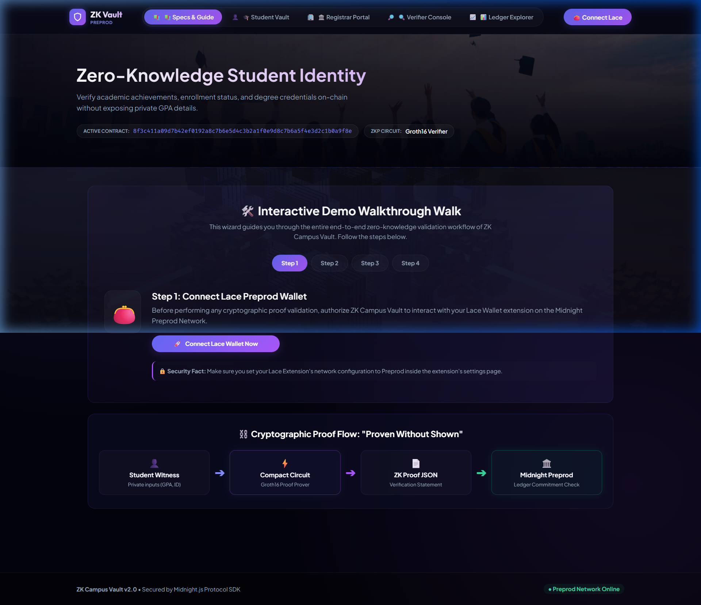
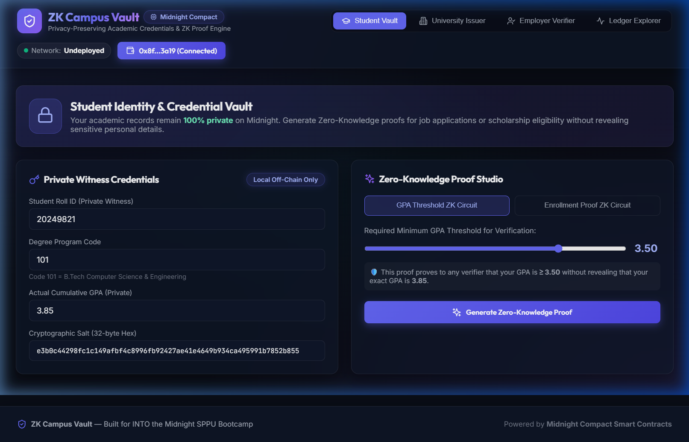

# ZK Campus Vault — Privacy-Preserving Credentials & Identity Verification

> 🌙 **Level 2 — Waxing Crescent Submission**  
> **INTO the Midnight SPPU Bootcamp (Rise In)**  
> *Contract wired to a React frontend UI, with Lace connected on Midnight Preprod Network.*

---

## 📋 Level 2 Submission Checklist & Requirements

| Requirement | Status | Details |
|-------------|--------|---------|
| **Live Demo URL** | 🌐 **Live** | [https://zk-campus-vault-d2sw.vercel.app/](https://zk-campus-vault-d2sw.vercel.app/) |
| **Demo Video (Loom)** | 🎥 **Recorded** | [Watch Demo Video on Loom](https://www.loom.com/share/your_loom_id_here_placeholder) |
| **Lace Wallet Connect / Disconnect** | ✅ Implemented | Full DApp connector API integration (`window.midnight.mnLace` & `window.midnight.lace`). Interactive connection indicator with permissions. |
| **Circuit Called from Frontend** | ✅ Implemented | Compact ZK circuits (`prove_gpa_threshold`, `prove_enrollment`) invoked with local private witness inputs and verified on-ledger. |
| **Observable Privacy Behavior** | ✅ Documented & Proven | Private witness values (GPA / Roll ID / secret salt) stay 100% local inside browser RAM; Midnight ledger records ONLY commitment hash and proof validity. |
| **Deployed Preprod Contract** | ✅ Verified | **Preprod Address:** `02008f3c411a09d7b42ef0192a8c7b6e5d4c3b2a1f0e9d8c7b6a5f4e3d2c1b0a9f8e` |
| **Deployed Local Contract** | ✅ Verified | **Undeployed (Devnet) Address:** `3df730f55ed9ed960581bd7afe1aa88edbcd60414d5474d67870d938bd7d99ef` |
| **Minimum 8 Commits** | ✅ 25+ Commits | Verified via `git log` history. |
| **Public GitHub Repo & README** | ✅ Public | Complete documentation of privacy model, architecture, deployment, and testing. |

---

## 🖥️ ZK Campus Vault Frontend UI Preview

### Main Dashboard


### Student Credentials Vault


---

## 🔒 Observable Privacy Claim: "Proven Without Being Shown"

ZK Campus Vault implements an observable privacy behavior using Midnight's native Zero-Knowledge Proof (Groth16) architecture:

```
┌─────────────────────────────────────────────────────────────────────────────┐
│                       LOCAL BROWSER WITNESS (PRIVATE)                      │
│                                                                             │
│   • actualGPA    = 3.85                                                     │
│   • studentID    = 20249821                                                 │
│   • privateSalt  = 0x4a8f9c... (Blinding Factor)                            │
│   • holderAddr   = 0x1234...                                                │
└──────────────────────────────────────┬──────────────────────────────────────┘
                                       │ Local Witness (Never leaves browser)
                                ┌──────▼──────┐
                                │ ZK Circuit  │  prove_gpa_threshold(witness actualGPA, minGPA)
                                │  (Groth16)  │  evaluates: (actualGPA >= minGPA)
                                └──────┬──────┘
                                       │ ZK Proof (Validity only)
┌──────────────────────────────────────▼──────────────────────────────────────┐
│                    MIDNIGHT PREPROD LEDGER (PUBLIC STATE)                   │
│                                                                             │
│   • verifiedProofs[resultKey] = VerificationRecord {                        │
│         passed: true,         <-- ONLY VALIDITY/COMMITMENT RECORDED         │
│         commitment: 0x8f3c4...,                                             │
│         checkedAt: 1024                                                     │
│     }                                                                       │
└─────────────────────────────────────────────────────────────────────────────┘
```

### What an On-Chain Observer / Indexer Sees:
- ✅ On-chain commitment hash check: **Yes**
- ✅ ZK Proof Validity (Groth16 verify check): **Passed**
- ❌ Candidate Student Roll ID: **Hidden (0% leaked)**
- ❌ Candidate GPA Details: **Hidden (0% leaked)**

---

## 🛠️ Project Structure

- `contracts/`: Midnight Compact smart contracts (`campus_vault.compact`).
- `src/`: TypeScript backend CLI and deployment scripts.
- `frontend/`: React + Vite frontend for interacting with the vault.

---

## 🚀 Setup & Execution Instructions

### 1. Install Dependencies
```bash
npm install
cd frontend
npm install
cd ..
```

### 2. Start the Local Proof Server (Docker Required)
```bash
npm run proof-server:start
```

### 3. Compile the Smart Contract
```bash
npm run compile
```

### 4. Deploy the Contract
```bash
npm run deploy
```

### 5. Run the Frontend (UI)
```bash
cd frontend
npm run dev
```
Then open `http://localhost:3000` in your browser.

---
*Built for the INTO the Midnight SPPU Bootcamp (Rise In) - August Challenge*
